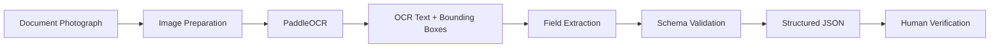

# Mosaic

## AmazôniaHack 4.0 — Challenge 2

### From Photographed Paper to Structured Data

**Team:** Outlier

Mosaic is a lightweight document-processing pipeline that converts photographed Brazilian environmental enforcement documents into structured JSON while preserving uncertainty for human verification.

## Problem

Environmental enforcement workflows still involve photographed paper documents containing printed text, handwriting, checkboxes, coordinates, identifiers, legal references, and other structured information.

Manual transcription is slow and makes it difficult to reuse and validate information across documents.

## Solution

Mosaic transforms a photographed document into validated structured data through a local OCR and extraction pipeline.



## Pipeline

```text
Document Image
      ↓
Image Preparation
      ↓
PaddleOCR
      ↓
OCR Text + Bounding Boxes
      ↓
Structured Field Extraction
      ↓
Pydantic Schema Validation
      ↓
JSON Output
      ↓
Human Verification
```

## Key Principles

* **Transcribe rather than invent.**
* **Preserve values as they appear in the document.**
* **Return `null` when a value cannot be reliably extracted.**
* **Surface uncertainty instead of silently guessing.**
* **Keep the baseline pipeline lightweight and locally runnable.**

## Current Capabilities

The current prototype extracts structured information such as:

* Document type
* Document number
* Series
* Year
* Issued date
* Issued time
* Municipality
* Agency
* Party information
* Property name
* Area
* Fine amount when reliably readable
* Officer registration
* Legal references
* Coordinates when available

The pipeline is designed for Portuguese-language environmental enforcement documents.

## Example


### Input

```text
infraction-notice.jpg
```

### Structured Output

```json
{
  "document_type": "infraction_notice",
  "number": "00831",
  "series": "A18",
  "year": "2026",
  "issued_date": "10/06/2026",
  "issued_time": "15:42",
  "municipality": "PARAGOMINAS",
  "agency": "SEMMA",
  "property_name": "Fazenda Santa Terezinha",
  "area_ha": 18.9862,
  "fine_brl": null,
  "coordinates": [],
  "officer_registration": "113.2207"
}
```

## Uncertainty Handling

Mosaic deliberately avoids guessing ambiguous values.

For example, when handwriting or image quality prevents reliable interpretation of a monetary value, the system keeps the field as `null` rather than generating a potentially incorrect value.

This is intentional: an explicit missing value that requires human verification is preferable to silently inserting an incorrect value into an enforcement record.

## Privacy

The official AmazoniaHack participant dataset is **not included in this repository**.

The project repository contains the processing code and documentation only. Participant documents should be handled according to the official hackathon dataset rules and should not be redistributed.

## Cost and Deployment

The baseline pipeline uses local, open-source tooling and does not require sending enforcement documents to an external API.

This makes the prototype suitable for controlled environments where document privacy and operational costs are important.

## Current Limitations

The current prototype is a baseline and has not been validated across every municipality or document variation.

The main limitations are:

* Handwritten fields are harder to extract reliably.
* Complex coordinate transcription requires stronger visual validation.
* Checkbox interpretation can require spatial analysis.
* Cross-document reconciliation is not yet implemented.
* Some fields may require human verification when the image is ambiguous.

These limitations are surfaced rather than hidden through unsupported inference.

## Running the Project

Install the dependencies:

```bash
pip install -r requirements.txt
```

Run the extraction pipeline:

```bash
python scripts/run_extraction.py --input "path/to/document.jpg"
```

## Project Structure

```text
amazoniahack/
├── scripts/
│   ├── ocr_engine.py
│   ├── extract_fields.py
│   ├── schema.py
│   └── run_extraction.py
├── requirements.txt
├── .gitignore
└── README.md
```

## Requirements

The baseline stack uses:

* Python
* PaddleOCR
* PaddlePaddle
* OpenCV
* Pillow
* Pydantic

See `requirements.txt` for the project dependencies.

## Challenge Alignment

| Challenge Requirement    | Mosaic                                       |
| ------------------------ | -------------------------------------------- |
| Structured output        | Pydantic-validated JSON                      |
| OCR                      | PaddleOCR                                    |
| Portuguese documents     | Portuguese OCR pipeline                      |
| Uncertainty              | Ambiguous values remain `null`               |
| No unsupported inference | Extraction avoids inventing missing values   |
| Human verification       | Uncertain fields can be reviewed             |
| Cost awareness           | Local open-source baseline                   |
| Privacy                  | Participant dataset excluded from repository |

## Team

**Outlier**

Built for **AmazôniaHack 4.0 — Challenge 2: From Photographed Paper to Structured Data**.
